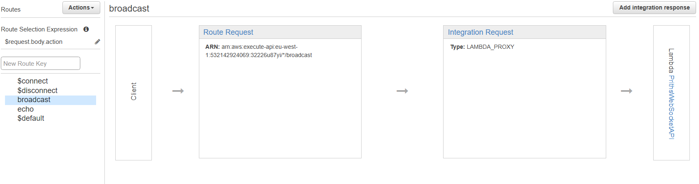
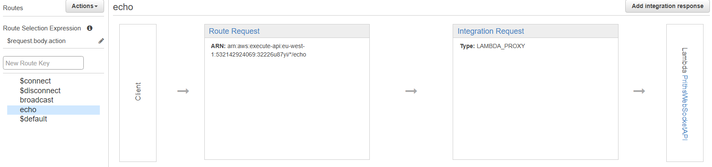

##### [🔙Back to Home](https://github.com/prithvi2k2/Alexa-VoiceUI-Controlled-Drone/#alexa-voiceui-controlled-drone)
---

In this section, we __create a WebSocket server using API Gateway's endpoint and lambda as backend to create a persistent medium of low-latency communication between the Alexa skill lambda and GCS__

- Create a new lambda function with `Node.js 16.x`, paste [this](./lambda/index.js) in `index.js` of new lambda

- Create a new DynamoDB table `SOME_TABLE` for storing connection ids of active clients connected to WebSocket

- Add `TABLE: SOME_TABLE` to environment variables of lambda function

- Create a new __WebSocket__ API in AWS API Gateway, configure it according to below images

👇Images

- Set route selection expression to __`$request.body.action`__

- After creating and deploying WebSocket API, navigate to `Stages` and select a stage, copy the WebSocket URL

- Paste the url as `ENDPOINT` variable in `index.js` of WebSocket Lambda, paste it in `main.py` of GCS and also in `wsSend` function of Alexa's Lambda

- Deploy the lambda function

---

## Known issues

None